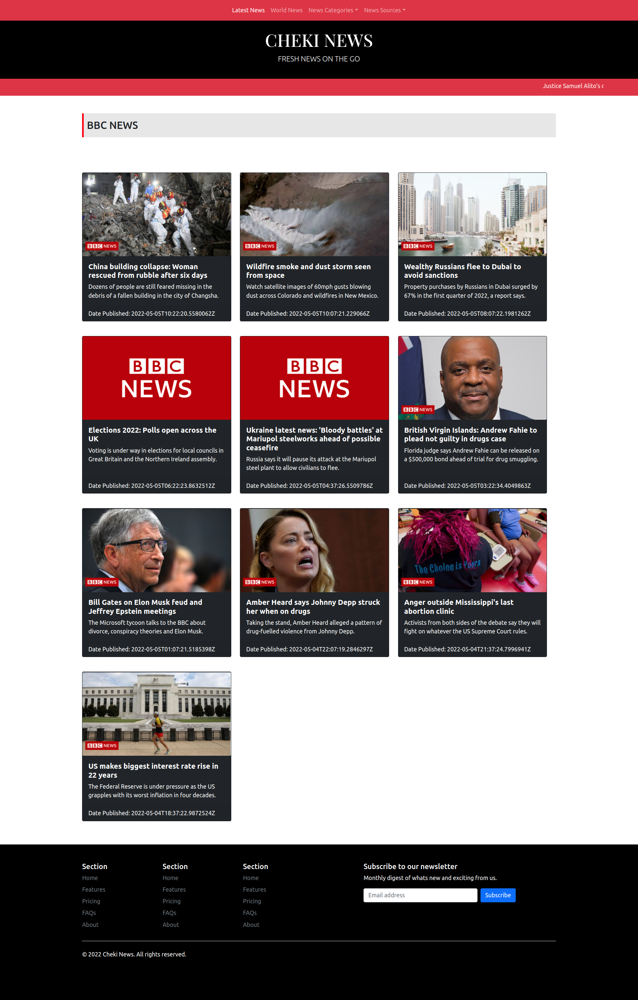

# GithubFinder

Cheki News is a web application developed using Python / Flask framework that fetches and displays world news from different sources using the NewsApi .

## Project Preview

## Technologies Implemented in this Project

1. Python 3.8
2. Bootstrap5
3. JavaScript
4. Custom CSS
5. MarkDown
6. News API

## Project Author

Name: Nimrod Musungu  
Email: nimrod.chitayi@gmail.com 
Website: nimrodmusungu.com

## Known Bugs

There are no known bugs currently but pull requests are allowed incase you spot a bug

## Contribution

Pull requests are welcome. For major changes, please open an issue first to discuss what you would like to change.

Please make sure to update tests as appropriate.

## License

[MIT](https://choosealicense.com/licenses/mit/)

